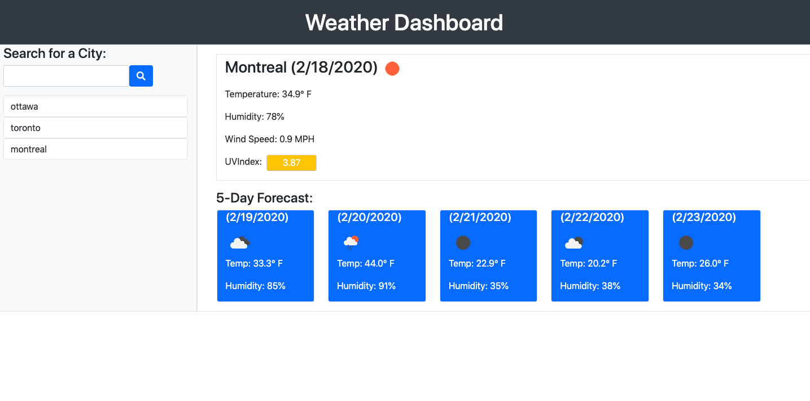

https://dustinirving.github.io/weather-forecast/

# weather-forecast
The main objective of this project was to make use of a server-side API to retrieve weather data. The user can choose a specified city and the DOM will be updated with current information regarding the weather for today as well as the next 5 days. The temperature,humidity, wind speed and UV index is displayed for the current date as well an icon relating to the weather conditions. For the 5-day forecast, a weather icon, the temperature and humidity are displayed.

## Diving Deeper
When the user opens the page weather data is first initialized with ottawa. The user can enter a city and click the search button. When the user clicks the button a button with the specified city is added to a list of buttons. The DOM is updated with that city's weather data. The user can then click on the appended buttons to change the weather information to that city.

When the page is refreshed, the buttons are retrieved from local storage and appended to list of cities. Also, the weather information for the most recent city is displayed on the screen.

For the current weather data, the UV index is color coded based on its value. If the UV index is greater or equal to 8, then it is red. If it is greater than 2, but less than 8, it is yellow. Finally, if it is less than 2, then it is green.

## Visual Display

## Future Endevers
- Allow the user to compare weather properties between cities
- Add a map with temperatures at different cities
- Add a graph to display weather properties over a period of time